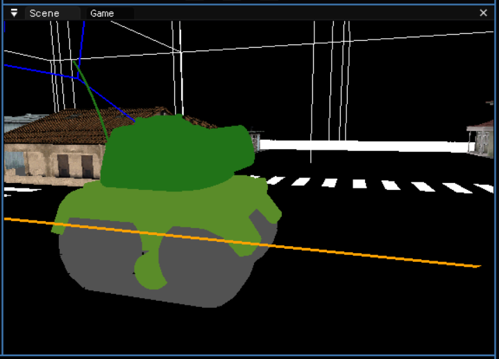

# Welcome to CapibaraEngine 3

## Intro

In this page you will find every piece of information regarding CapibaraEngine3, an university project made by a team of three students of Video Game Design and Development Degree, for the subject "3D Engines" at the Centre de la Imatge i la Tecnologia Multimedia (CITM) in Terrassa, Catalunya.

## Team Members
The first two original members of the CapibaraEngine are:

- [Albert Pou](https://github.com/Hydeon-git)

### Tasked with:

- Tank scene implementation

- Fbx Load

- Scripting Module

- [Arnau Bonada](https://github.com/arnaubonada)

### Tasked with:

- Tank movement and rotation systems

- Capibara Logo implementation

- Scrip resources

- Then [Pol Pallares](https://github.com/Zeta115) joined the team in at the start of the second assignment due to his first team splitting up.

### Tasked with:

- Webpage Management

## Main Core Sub-systems

## In the first assignment

### Models and .fbx Import

- Basic Shape primitives: Cube, Pyramid and Sphere.

- Drag & Drop functionallity.

- .fbx Objects can be loaded and be visible in the engine.

- 3 different .fbx models included in the engine (/Assets folder).

- Baker_house was automatically loaded at the start.

- Two models in FBX format with one channel diffuse texture.

- Drag&drop of FBX files from anywhere in the Hard Drive.

- Drag&drop of DDS/PNG files.

- GameObject structure, one for each loaded mesh. Each GameObject having 3 display-only components: Transform, Mesh and Texture.

### Camera

- While Right clicking, WASD to move around the scene.

- Mouse wheel for zoom in and zoom out.

- Holding SHIFT duplicates movement speed.

- Alt+Left click to orbit around the object.
-
- "F" to focus the camera around the geometry.

### Editor Windows

- Console: The console LOGS the geometry loading process.

### Configuration

- A graph for the frames per second.

- Configuration for all variables on each module (renderer, window, input, textures).

- Information output of memory consumption, hardware detection and software versions (SDL, OpenGL, DevIL).

- Exit option in general menu to exit the engine.

### Hierarchy window

- Displaying a list of all GameObjects

- GameObject selection

### Inspector

- Displays information about the components of the selected GameObject

- Transform: only for display purposes. Show position, rotation and scale for the selected GameObject.

- Mesh: information about the loaded mesh. There should be an option to display its normals (per-triangle and per-face).

- Texture: display texture size and path. There should be an option to view the selected GameObject with the checkers texture.

### Menus

- About window with github link and information about the engine

- Option to turn on/off editor windows

## In the second assignment

- The "Street environment" was loaded at the start automaticaly

- The user can now use the inspector to modify a Gameobject's:

· *Hierarchy*: Deleting, reparenting, creating emptys or creating children.

· *Transform*: Traslading, rotating and scaling GameObjects.

· *Mesh* :  Selecting and/or droping any imported mesh.

· *Texture*: Selecting and/or dropping any imported texture.

· The Camera as a component.

- GameObjects can be picked using the mouse.

- All meshes use AABB and can be discarted using Frustrum Culling(visualized in the editor).

- Models, Meshes and Textures saved in our own "Library" folder

- Scene serialized to a file to be loaded.

- Start/ Pause/ Stop mechanics added to the simulation and recovering original state.

- Editor with 2 windows: Editor view / Main in game camera viewing at the same time.

### Resource Management

- “Assets” window  showing all user assets.

- The user can drop/import new files.

- Asset files can be deleted through the window.

- Upon start, all resources not managed inside Assets are generated in Library.

- All resources use reference counting, this process is visualized in the editor.

## The last assignment

Due to the engine being done under a university project the diferent teams have a diferent sub system to program, in our case we are programing an scripting system for the third and last delivery, every student in our class agreed to fork their projects from the [Ragnar Engine](https://github.com/UriKurae/Ragnar-Engine) and their original owners were: 

- Oriol Bernal ([UriKurae](https://github.com/UriKurae))

- Lucas Pérez ([LucasPG14](https://github.com/LucasPG14))

###  General Contents

- Full Engine's Website

- Default window at 1024 x 768 centered on the screen

- Resizable window.

- Build Loads directly from the scene

### Scripting Contents

(Image of the in-game Tank)

- Tank moves using the keyboard (W,A,S,D).

- Tank shoots with Left Click on the mouse(Bullets are new GameObjects and have lifetimes).

- In-editor text window to edit scripts.

(Image of the Tank and turret in the scene)

## Explanatory video

Link to the video [here](https://www.youtube.com/watch?v=dQw4w9WgXcQ) or watch it in our page:

<iframe width="560" height="315" src="https://www.youtube.com/embed/dQw4w9WgXcQ" title="YouTube video player" frameborder="0" allow="accelerometer; autoplay; clipboard-write; encrypted-media; gyroscope; picture-in-picture" allowfullscreen></iframe>

## Usefull Links

- Link to the code repository [here](https://github.com/Hydeon-git/CapibaraEngine3)

- Link to the latest release ready to download [here](https://github.com/Hydeon-git/CapibaraEngine3/releases)

## License

- This project is suported under an MIT license link [here](https://github.com/Hydeon-git/CapibaraEngine3/blob/main/LICENSE.md) or read the complete license below:

MIT License

Copyright (c) 2021 CapibaraEngine

Permission is hereby granted, free of charge, to any person obtaining a copy of this software and associated documentation files (the "Software"), to deal in the Software without restriction, including without limitation the rights to use, copy, modify, merge, publish, distribute, sublicense, and/or sell copies of the Software, and to permit persons to whom the Software is furnished to do so, subject to the following conditions:

The above copyright notice and this permission notice shall be included in all copies or substantial portions of the Software.

THE SOFTWARE IS PROVIDED "AS IS", WITHOUT WARRANTY OF ANY KIND, EXPRESS OR IMPLIED, INCLUDING BUT NOT LIMITED TO THE WARRANTIES OF MERCHANTABILITY, FITNESS FOR A PARTICULAR PURPOSE AND NONINFRINGEMENT. IN NO EVENT SHALL THE AUTHORS OR COPYRIGHT HOLDERS BE LIABLE FOR ANY CLAIM, DAMAGES OR OTHER LIABILITY, WHETHER IN AN ACTION OF CONTRACT, TORT OR OTHERWISE, ARISING FROM, OUT OF OR IN CONNECTION WITH THE SOFTWARE OR THE USE OR OTHER DEALINGS IN THE SOFTWARE.

